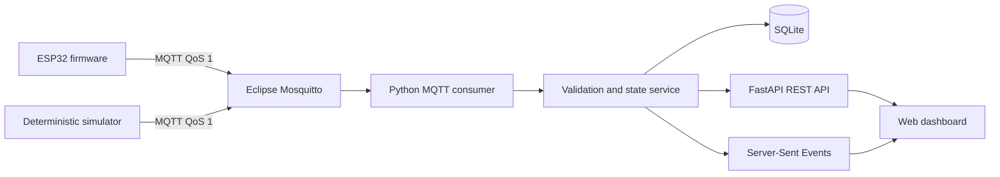

# ESP32 MQTT Dashboard

A production-style, locally reproducible IoT telemetry system. An ESP32 firmware
target—or a deterministic software device—publishes environmental telemetry through
an authenticated Mosquitto broker. A Python service validates and persists each
message, exposes REST and Server-Sent Events APIs, and serves a live monitoring
dashboard.

The project focuses on **networked IoT reliability and integration**: Wi-Fi recovery,
MQTT QoS 1, retained presence, Last Will and Testament (LWT), strict contracts,
idempotent ingestion, persistence, live visualization, and automated end-to-end tests.
Sensor hardware, SD logging, RTCs, battery monitoring, and deep sleep are deliberately
outside its scope.

## Architecture



See [architecture details](docs/architecture.md), the
[MQTT contract](docs/mqtt-contract.md), and [security guidance](docs/security.md).

## Key features

- Modular ESP32/Arduino C++ firmware built with PlatformIO
- bounded exponential Wi-Fi and MQTT reconnect scheduling with jitter
- deterministic synthetic telemetry and NTP-aware timestamps
- MQTT QoS 1 telemetry, retained status/configuration, and retained offline LWT
- strict topic, identity, JSON, range, finite-number, and payload-size validation
- asynchronous MQTT callback/worker boundary so database work does not block networking
- SQLite uniqueness on `(device_id, boot_id, sequence)` for QoS 1 duplicate tolerance
- distinct online/offline and telemetry-derived stale state
- FastAPI REST API, SSE event feed, and responsive vanilla JavaScript dashboard
- authenticated Mosquitto with ACLs, persistence, and loopback-only host bindings
- deterministic Python device simulation against the real MQTT broker
- unit, contract, firmware-native, container, LWT, and persistence integration testing

## Technology

ESP32 Arduino C++ · PlatformIO · 256dpi/MQTT · Mosquitto 2 · Python 3.12 ·
Paho MQTT · FastAPI · Pydantic · SQLite · HTML/CSS/JavaScript · Docker Compose

## Quick start

Requirements: Docker Desktop with Compose. Physical hardware is not required.

### Windows PowerShell

```powershell
Copy-Item .env.example .env
# Edit .env and replace every change-*-password value.
docker compose --profile demo up --build -d
Start-Process http://localhost:8000
```

Or run `./tools/run_demo.ps1` after creating `.env`.

### Linux/macOS

```sh
cp .env.example .env
# Edit .env and replace every change-*-password value.
docker compose --profile demo up --build -d
```

Open <http://localhost:8000>. The simulator publishes continuously and the dashboard
updates through SSE without a refresh.

Stop the demo without deleting persisted data:

```sh
docker compose --profile demo down
```

Remove the local demo data as well:

```sh
docker compose --profile demo down --volumes
```

## MQTT contract

| Topic | QoS | Retained | Direction |
|---|---:|---:|---|
| `iot/v1/devices/{device_id}/telemetry` | 1 | no | device → backend |
| `iot/v1/devices/{device_id}/status` | 1 | yes | device/LWT → backend |
| `iot/v1/devices/{device_id}/config` | 1 | yes | operator → device |
| `iot/v1/devices/{device_id}/config/ack` | 1 | yes | device → backend |

Device IDs must match `[a-z0-9][a-z0-9_-]{0,63}`. MQTT wildcards and additional
topic levels are rejected. QoS 1 is at-least-once—not exactly-once. The backend safely
ignores duplicate telemetry identities while counting duplicate deliveries.

Example telemetry:

```json
{
  "schema_version": 1,
  "device_id": "esp32-demo-01",
  "boot_id": "4f88d294",
  "sequence": 42,
  "sampled_at": "2026-10-03T15:30:12Z",
  "uptime_seconds": 3600,
  "temperature_c": 22.4,
  "humidity_percent": 48.1,
  "pressure_hpa": 1013.2,
  "wifi_rssi_dbm": -56
}
```

`sampled_at` is `null` on firmware until NTP time is valid. The backend always adds an
authoritative `received_at`. See the contract document for ranges and status/config schemas.

## Presence, LWT, and stale state

Before MQTT connection, each device registers a retained offline will. After connection it
publishes retained online status and re-subscribes to its retained configuration. A graceful
shutdown explicitly publishes offline status; an unexpected transport loss causes Mosquitto
to publish the LWT.

Retained online status does not prove current liveness. The dashboard separately marks a
device **stale** when telemetry has not arrived within `STALE_AFTER_SECONDS`.

## Runtime configuration

Devices accept one deliberately small command:

```json
{"schema_version":1,"telemetry_interval_seconds":10}
```

The valid range is 1–3600 seconds. The device publishes a retained `applied` or `rejected`
acknowledgement. This is not a general remote-command framework.

## REST and SSE API

- `GET /api/health`
- `GET /api/devices`
- `GET /api/devices/{device_id}`
- `GET /api/devices/{device_id}/telemetry?limit=100`
- `GET /api/events?limit=50`
- `GET /api/stream` (`text/event-stream`)
- interactive OpenAPI documentation at `/docs`

History limits are bounded. The SSE stream sends telemetry, status, config acknowledgement,
and rejection events plus keepalives; browser `EventSource` reconnects automatically.

## Simulator

The Compose `demo` profile runs a deterministic Python device against Mosquitto. For a finite
manual run from the simulator directory:

```sh
python -m simulator --device-id esp32-demo-01 --count 20 --interval 1 --seed 42
```

It supports a fixed seed, boot ID, finite or continuous operation, graceful shutdown, and
`--abrupt` transport termination for LWT testing. It never writes directly to the backend.

## Physical ESP32 setup

1. Copy `firmware/include/secrets.example.h` to `firmware/include/secrets.h`.
2. Set Wi-Fi and MQTT credentials locally; `secrets.h` is ignored.
3. Change `kMqttHost` in `firmware/include/app_config.h` to the Docker host's LAN address.
   Do not use `localhost`: on the ESP32 that means the ESP32 itself.
4. Add a per-device broker username and ACL entry if the device ID differs from the demo ID.
5. Explicitly expose MQTT to the LAN:

```powershell
docker compose -f compose.yaml -f compose.lan.yaml up --build -d
```

LAN exposure is opt-in. Review the host firewall and use a trusted local network.

Build and test firmware:

```sh
cd firmware
pio test -e native
pio run -e esp32dev
```

Compilation demonstrates source/toolchain compatibility only; it is not physical verification.

## Development tests

```sh
cd backend
python -m pip install -e ".[dev]"
pytest
ruff check .
ruff format --check .

cd ../simulator
python -m pip install -e ".[dev]"
pytest
ruff check .
ruff format --check .

cd ..
docker compose config --quiet
docker compose build
python tools/integration_test.py
```

The integration script builds an isolated stack and verifies simulator → Mosquitto → backend
→ SQLite → API, malformed-message survival, retained LWT processing, dashboard delivery, and
persistence across a backend restart. It removes its test volumes on completion.

GitHub Actions runs Python quality/tests, firmware native tests and ESP32 compilation, Compose
validation/builds, and the Docker integration test without physical hardware.

## Configuration and security

- Host ports `1883` and `8000` bind to `127.0.0.1` by default.
- Anonymous MQTT access is disabled.
- Broker passwords are generated inside the broker container from environment variables.
- Device, backend, and integration-test users have distinct ACL roles.
- Payload and query sizes are bounded; SQL is parameterized.
- Credentials, firmware secrets, databases, build output, and generated password files are ignored.

Replace all example passwords. The demo uses plaintext MQTT on a trusted local machine.
Production requires TLS, per-device provisioning, credential rotation, stronger device identity,
network segmentation, monitoring, and managed secret storage.

## Repository structure

```text
backend/       FastAPI, MQTT ingestion, SQLite, SSE, dashboard, pytest
broker/        Mosquitto image, configuration, authentication, ACL
firmware/      PlatformIO ESP32 firmware and native C++ tests
simulator/     deterministic Python MQTT device
tests/         shared contract fixtures and integration assets
tools/         cross-platform demo/integration/evidence helpers
docs/          architecture, protocol, security, generated evidence
.github/       CI and Docker integration workflows
```

## Verification status

The exact checks run for the current commit are recorded in the final implementation report and
generated integration evidence. CI independently repeats all software-only checks.

Physical ESP32 Wi-Fi, MQTT connectivity, RSSI readings, sensor behavior, and long-duration
hardware stability are **not physically verified** by this repository. Environmental readings
in the MVP are explicitly synthetic.

## Limitations and future work

- Local demo traffic is not encrypted.
- SQLite is intentionally single-node storage.
- ACL provisioning is static and demonstration-oriented.
- The dashboard uses in-memory SSE fan-out; multi-process deployment would need a shared bus.
- Next steps: physical ESP32 validation, TLS, per-device credential provisioning, longer soak
  testing, and richer operational metrics—without expanding into unrelated offline logging.

## License

MIT
